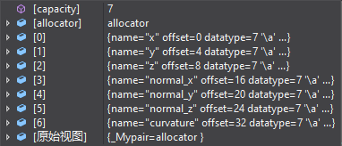
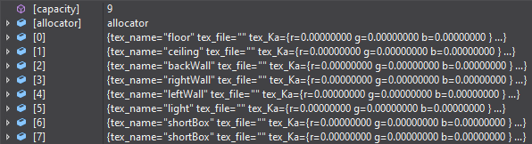

pcl自带两种网格类, 分别为PolygonMesh, TextureMesh
## PolygonMesh
PolygonMesh有三个成员: header, cloud, polygons  
header为pcl内部信息不重要  
cloud为模型中所有顶点  
  
默认线性排列，width宽为总点数，但data为字节流(vector<uint8>)，要访问对应的如x, y, n_x等得通过地址偏移再强转取值  
polygons则为模型所有面, 每个面由三个顶点索引组成  
## TextureMesh
TextureMesh对比PolygonMesh多了tex_coordinates, tex_materials  
tex_coordinates用eigen::vector2f表示UV坐标, 对应cloud中顶点顺序存放的所有UV坐标  
tex_materials为mtl里写好的材质, 重要的有tex_name材质名和tex_file文件名  
  

### 结论: 
TextureMesh的cloud每顶点属性没有纹理坐标, 在tex_coordinates里单独附上, 导致纹理坐标不好跟随顶点移动, pcl两种网格类有较多接口可以使用,   
但没法提供方便的使用方法, 考虑设计项目自己的网格类, 但提供到PolygonMesh, TextureMesh的相互转换
# CMesh类
 __SVertex__ 顶点属性包括x, y, z, normal_x, normal_y, normal_z, u, v  
 __SFace__ 每面固定为三角面片, 三点分别为a, b, c, 存的三点的索引  
构造支持空构造及用pcl两种网格类构造, 在需要转换为pcl两种网格类时使用 __toXxxMesh()__ 函数转换

