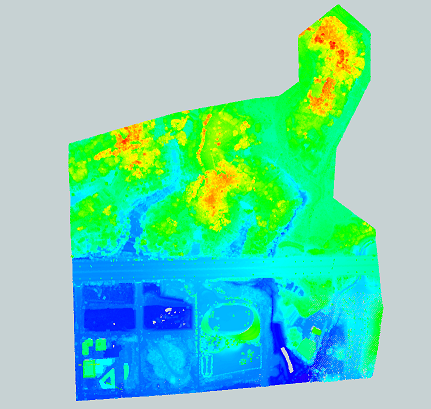

# 地物种子点提取类总体设计
## 实现的功能：
#### 对输入点云进行地物种子点的提取，作为之后区域生长算法的起始点。
## 基本思想：
 借助高程图的思想，地物与地面的区别在于其高程的差异：高程图中局部高程突出的部分大多为地物。  

  

对于输入的点云模型，为其生成高程图，根据高程信息确定可能的地物点位置，并反算回世界坐标下获取地物点索引  

## 总体设计：
#### 功能的划分：
功能的实现可划分为两大阶段：**点云生成高程图**、**高程图提取地物点**  

&emsp;&emsp;在第一阶段，需要接收点云模型、高程图分辨率，为点云模型生成高程图。根据分辨率，点云模型包围盒水平面会被划分为许多小格子，每个小格子对应高程图的一个像素，像素颜色应与高度存在映射关系。这里的高度指小格子对应世界坐标范围内点云的高程最大值。  

&emsp;&emsp;在第二阶段，需要接收高程图，通过高度阈值或图像处理的方法，确定出哪些个像素处最有可能为地物点，根据颜色映射关系与像素位置，反算出世界坐标下高度与水平范围，以此为依据确定地物点。最后地物点以点云索引的形式输出，作为区域生长的种子。

#### 类结构：
根据功能地物种子点提取类同属于分类器（classifier），故继承自*IPointClassifier*，其实例由工厂模式创建。

## 注意要点：
具体实现时需要注意：  
由于每块模型的绝对高程（z坐标值）并不从0起步，且远大于模型高度，需要选择合适的颜色高程映射关系以减少转化时的精度损失。  
根据高程图确定地物点具体方法未给出需要仔细斟酌。
