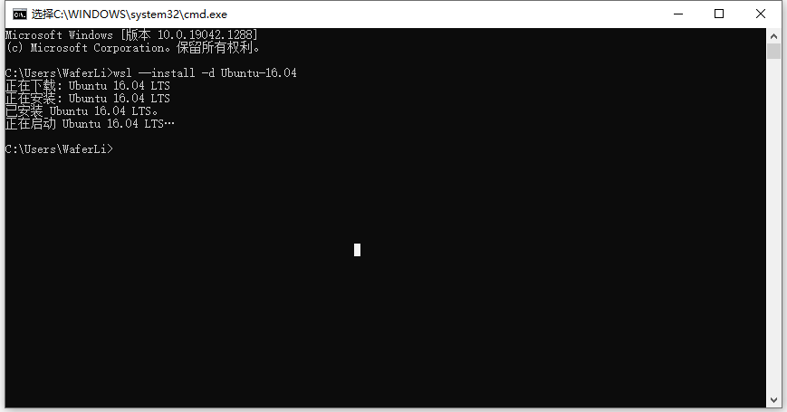
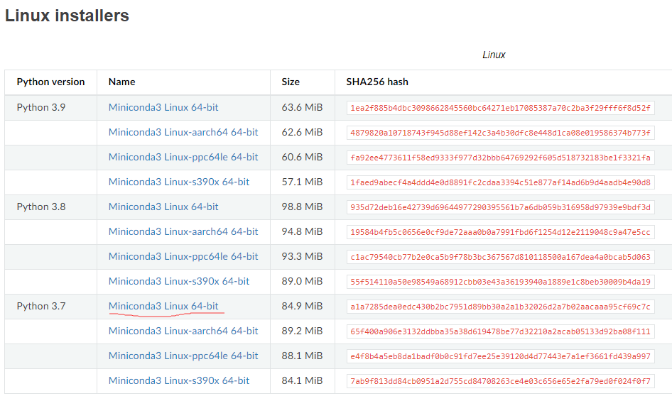
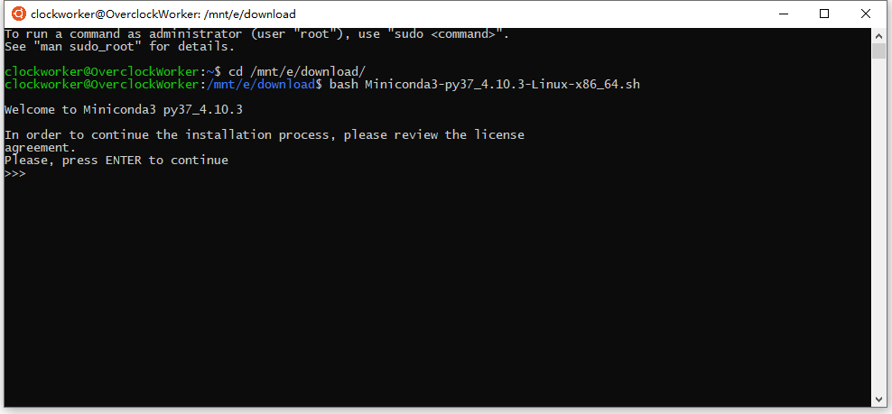
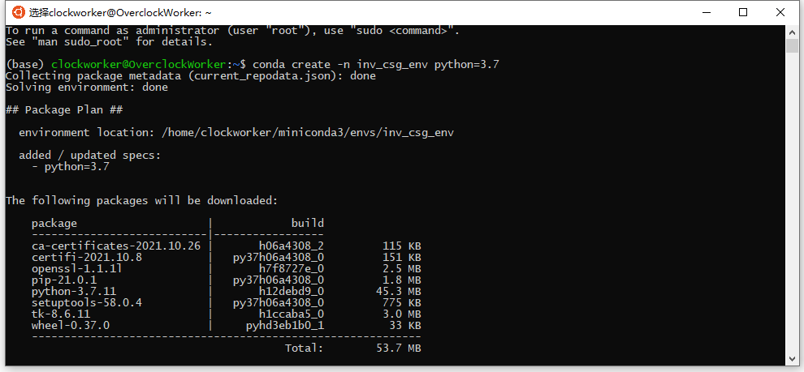
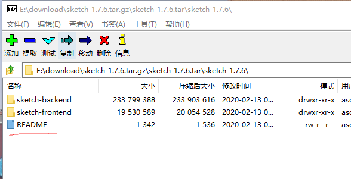
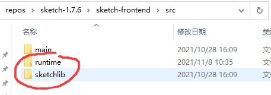
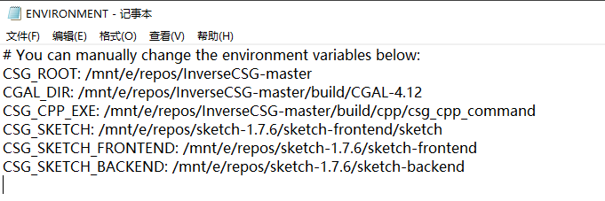
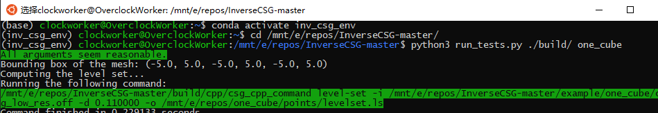

# InverseCSG环境配置
根据网络环境的不同，以下某些步骤可能需要尝试多次，最好翻个墙...  
注意，子系统中单击右键就是粘贴。

## 1. 启动“适用于Linux的Windows子系统”功能
在Windows的设置页面中搜索打开`启用或关闭Windows功能`。  
  
启动`适用于Linux的Windows子系统`，完成后需要重启。

## 2. 安装WSL(Windows Subsystem for Linux)
子系统需要使用Ubuntu16.04，在命令行中输入`wsl --install -d Ubuntu-16.04`。  
  
安装后在命令行中输入wsl或直接点击开始菜单中的Ubuntu快捷方式即可打开子系统。  
第一次打开需要设置账号名和密码。

## 3. 安装Miniconda
前往conda官网下载[Miniconda](https://docs.conda.io/en/latest/miniconda.html)，最好下载Python 3.7的版本。
  
记住下载路径，我这里是E:/download。  
打开子系统，前往Miniconda的下载路径，使用`bash`命令安装。
  
一路按`Enter`或输入`yes`确认即可。安装完成后需要重启命令行。

## 4. 加载conda环境
在子系统中输入`conda create -n inv_csg_env python=3.7`，从远程加载conda环境。
  
仍然是一路输入`y`确认即可。

## 5. 下载安装Sketch库
为了使用以前版本而非最新版的Sketch库，需要手动下载安装。  
前往官网下载[Sketch库](https://people.csail.mit.edu/asolar/sketch-1.7.6.tar.gz)。并按照压缩包内的README文件的指引安装。
  
注意，需要按照指引添加环境变量SKETCH_HOME。

## 6. 调整Sketch库目录
Sketch库默认的目录排布与InverseCSG库期待的不同，需要调整。

将runtime与sketchlib文件夹从sketch-frontend目录移动至sketch-frontend/src下

## 7. 安装其他依赖
在命令行输入`sudo apt-get install unzip`；
`sudo apt-get install openjdk-8-jdk-headless`；

## 8. 下载InverseCSG库
前往github下载[InverseCSG库](https://github.com/WaferLi/InverseCSG)即可。这个版本我预先配好了一些东西。  

## 9. 更改环境变量
打开InverseCSG-master/build目录下的ENVIRONMENT文件，将这些目录改成你实际安装的目录即可。（作为示例，我是安装在E:/repos下）

## 10. 运行测试脚本
先输入`conda activate inv_csg_env`启用conda环境。  
再进入InverseCSG的下载路径。
最后输入`python3 run_tests.py ./build one_cube`即可运行最简单的测试用例。
