# ***VS2019+QT5.14.2配置***

# **一、下载QT**

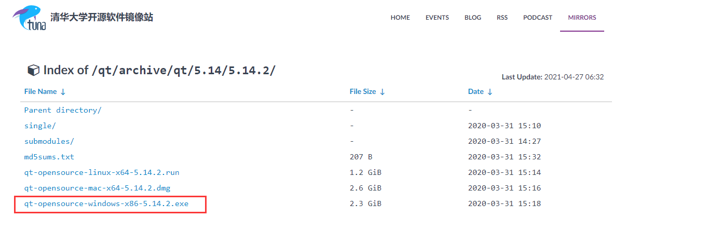

下载成功如下：

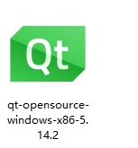

# **二、安装QT**

## 1.填写账号密码，没有就注册一个

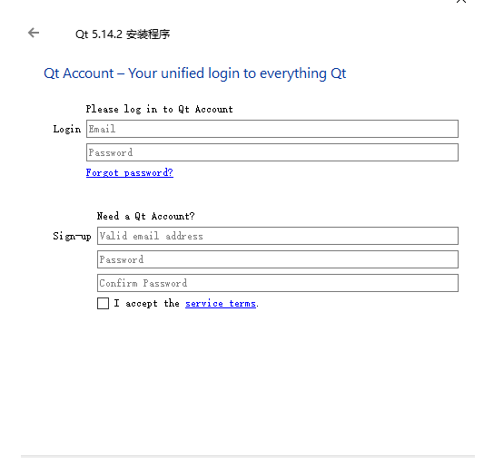

## 2.勾选下一步

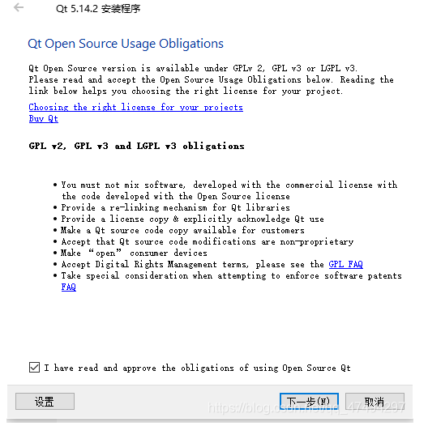

## 3.选择安装路径（路径不要有空格和中文）

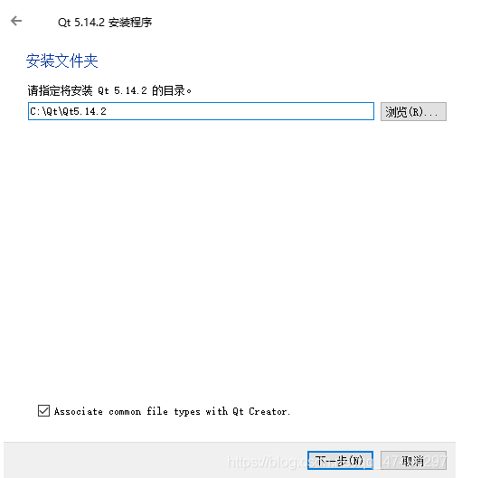

## 4.勾选MSVC 2017 64-bit

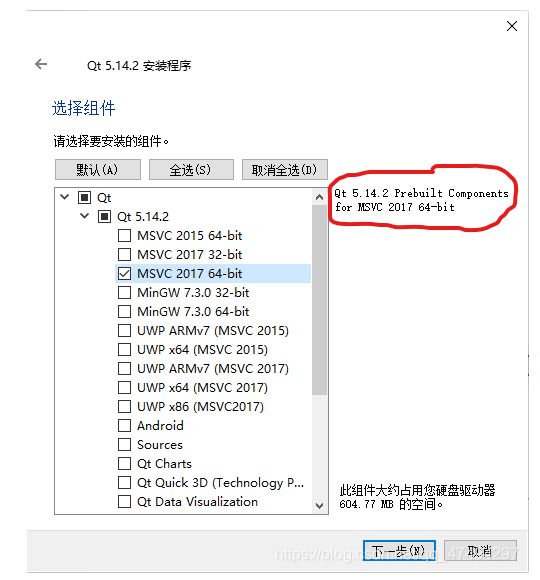

## 5.默认下一步，直接安装

## 6.安装成功后，配置环境变量

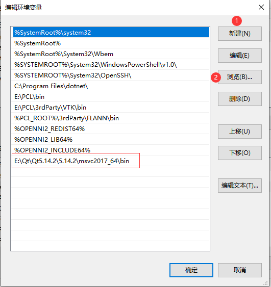

# **三、VS2019安装扩展工具**

## 1.设置取消VS2019自动更新扩展

       由VS2019处下载的最新版本扩展，兼容性不好，会出现问题，故这里使用旧版本2.4.3的VS插件，已分享到QQ群里，也可在如下网址下载：

[Index of /archive/vsaddin/2.4.3](https://download.qt.io/archive/vsaddin/2.4.3/)

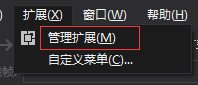

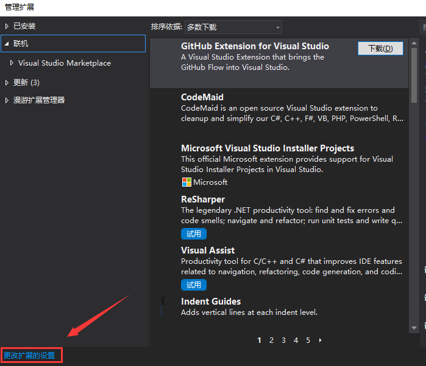

取消勾选【自动更新扩展】

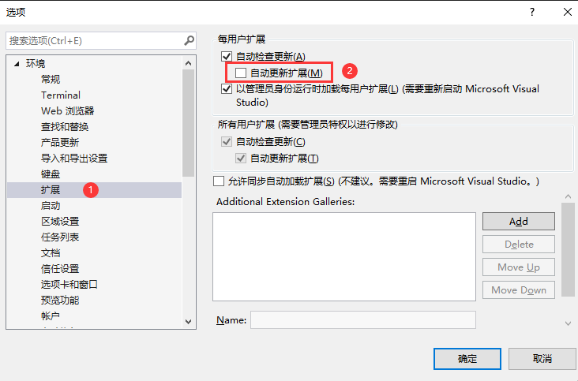

## 2.关闭VS2019，下载2.4.3版本扩展，默认运行安装。

## 3.配置QT路径

打开VS2019，菜单栏处出现【QT vs Tools】选项（有时会隐藏在【扩展】的级联菜单下）

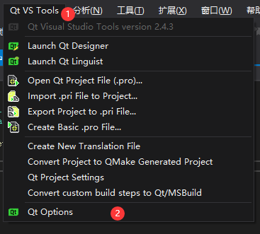

添加QT版本；  
添加后Name输入为msvc2017_64；  
** 注意：【QT vs Tools】插件中QT_Version的名字必须与QT项目属性中Qt Project Settings一页中的Qt Installation相同。在本项目中统一使用msvc2017_64 **

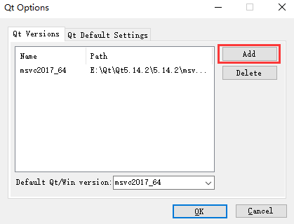

浏览路径

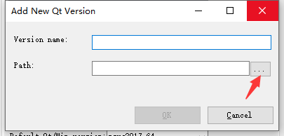

选择MSVC路径，我这里是E:\Qt\Qt5.14.2\5.14.2\msvc2017_64

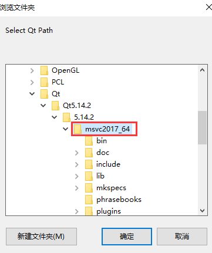

解决方案中QT项目配置

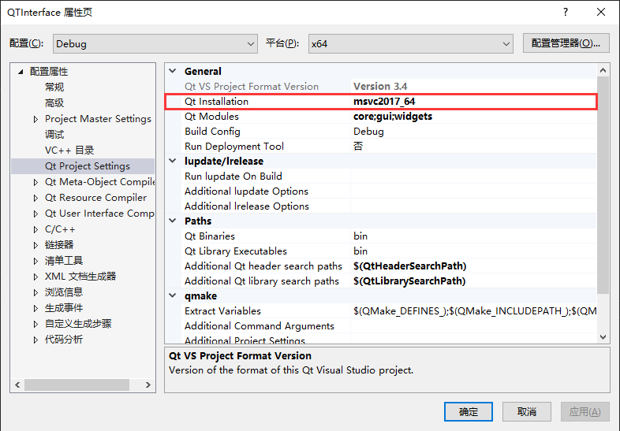

# **四、测试**

## 1.创建新项目

在搜索框搜索”QT“，选择”QT GuI Application“

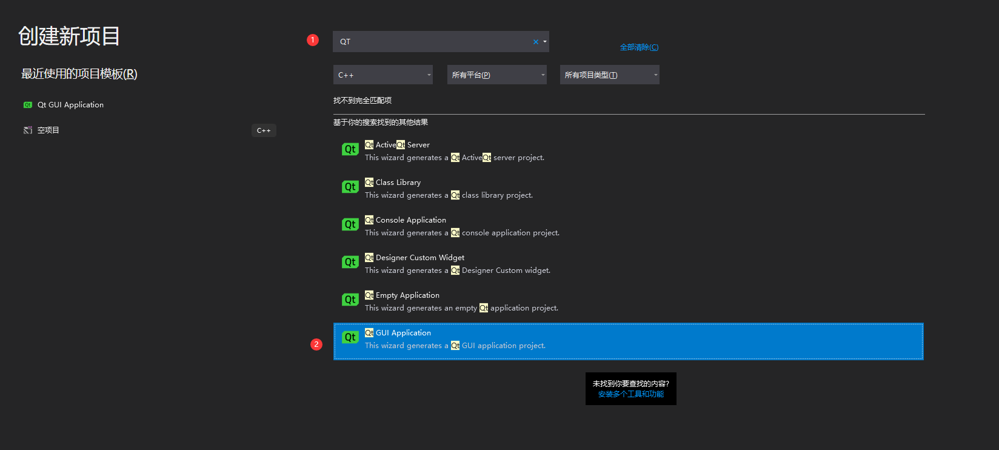

## 2.可以配置自己QT的工作目录

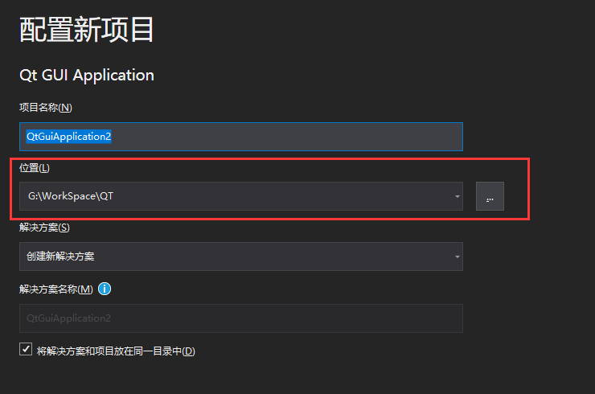

## 3.一路默认”Next“，直接Finish

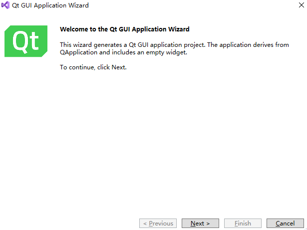

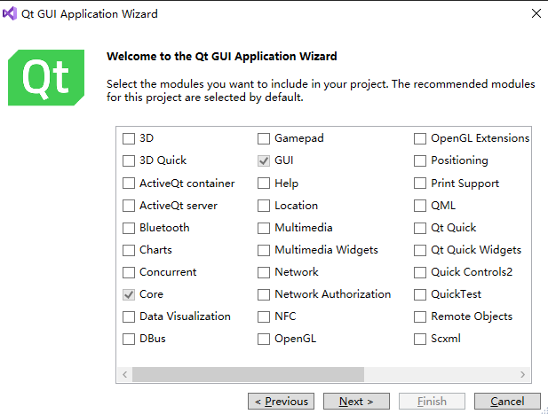

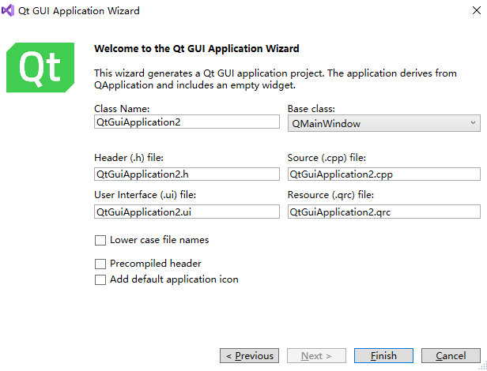

## 4.双击ui文件

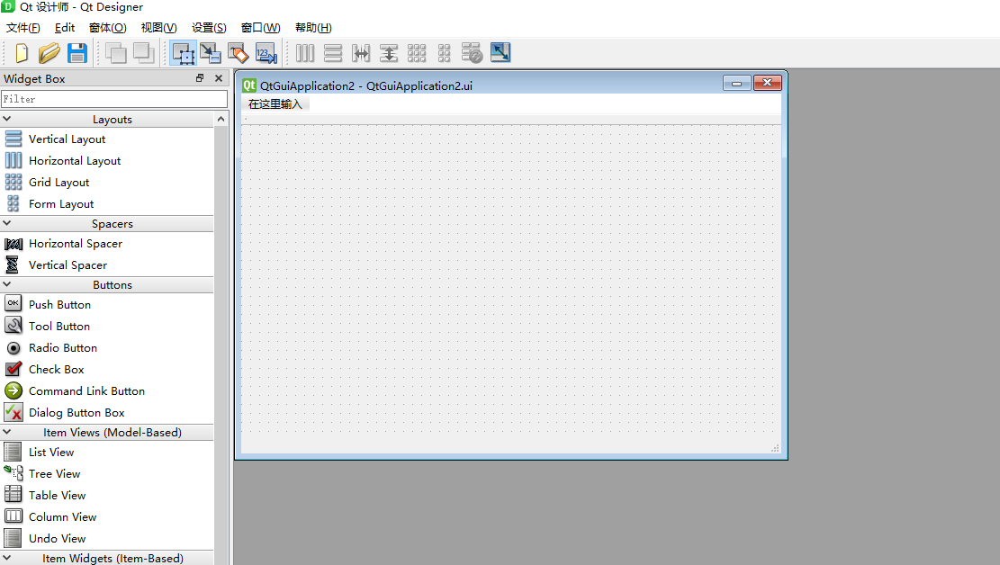

附注：若双击后并非打开QT Designer界面，则右键点击ui文件，选择”打开方式“，设置默认方式为”QT Designer“。

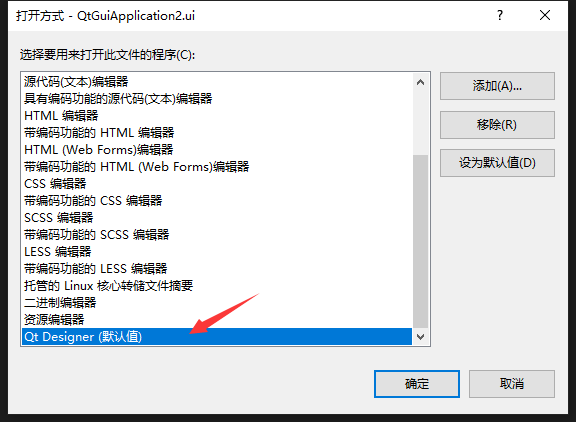

## 5.添加控件

按住【Label】，拖曳至设计界面

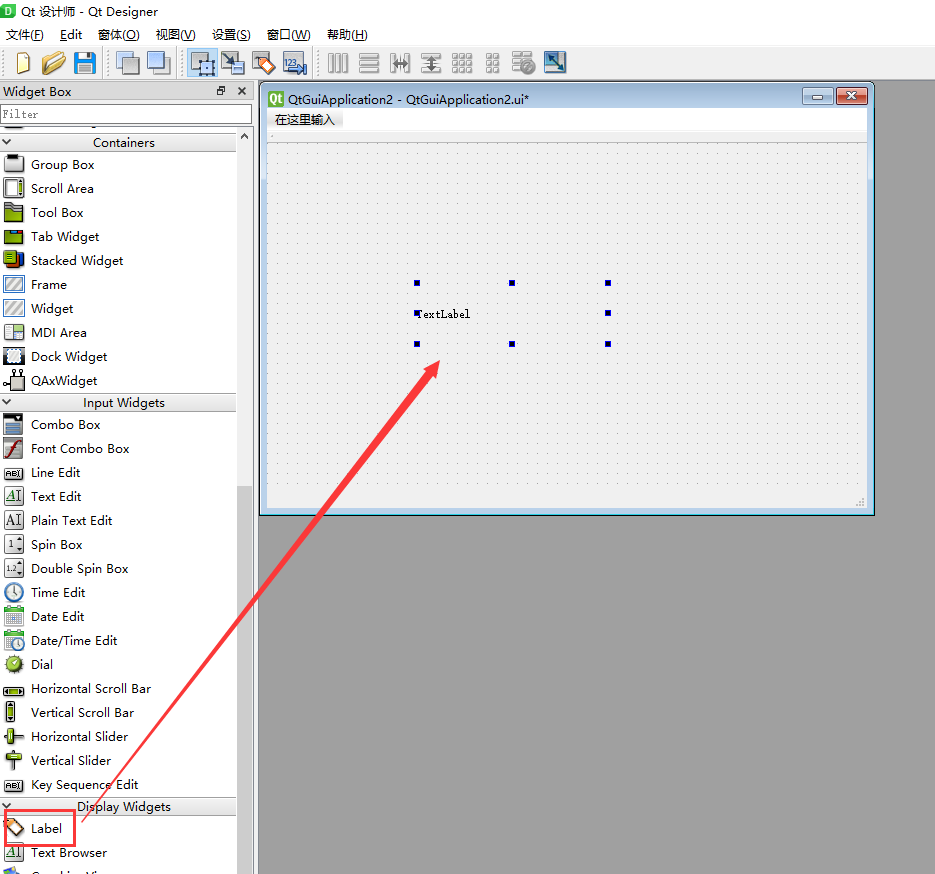

编辑控件内容，输入”Hello，World“，Ctrl+S保存。关闭QT Designer界面。

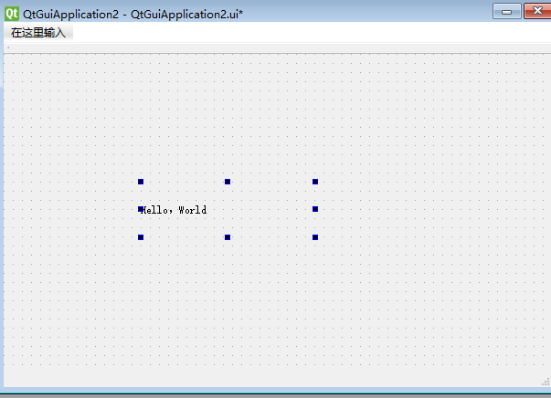

运行项目，弹出界面，显示”Hello World“，测试成功！

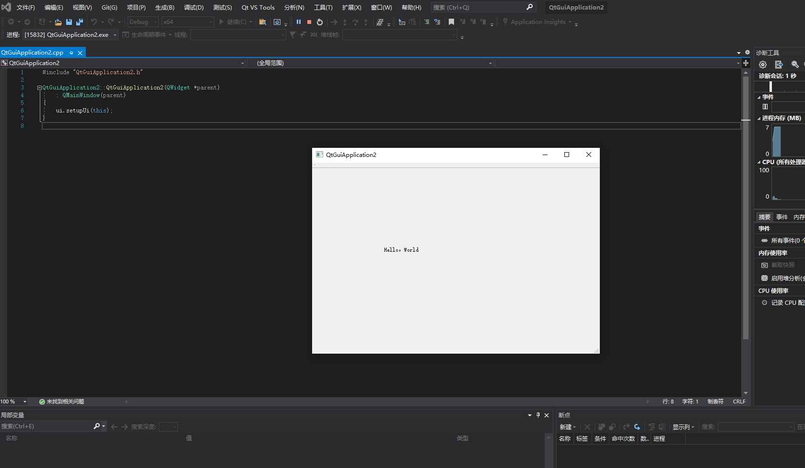

# 参考文献

[VS2019配置QT5.14.2_u012670181的博客-CSDN博客_vs配置qt](https://blog.csdn.net/u012670181/article/details/105600202)

 

[PCL1.10.1+VS2019+Qt5.14.2下载、安装及配置（强迫症福音~使用的软件均为最新版本）_zhao5269的博客-CSDN博客](https://blog.csdn.net/zhao5269/article/details/105311173)

[QT5.14.2+VS2019安装使用教程_5ang的博客-CSDN博客](https://blog.csdn.net/qq_47494297/article/details/105867476?utm_medium=distribute.pc_relevant.none-task-blog-2%7Edefault%7EBlogCommendFromBaidu%7Edefault-8.control&dist_request_id=&depth_1-utm_source=distribute.pc_relevant.none-task-blog-2%7Edefault%7EBlogCommendFromBaidu%7Edefault-8.control)

[VS2019下配置PCL1.10+QT5.14.2的坑 - 程序员大本营](https://www.pianshen.com/article/10221939097/)