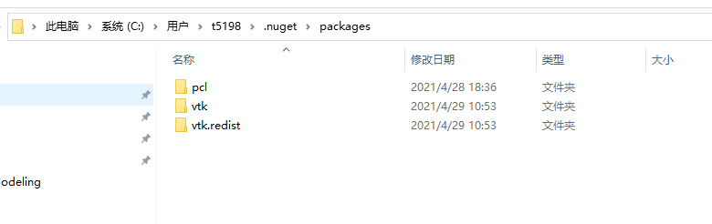

# ***编译pcl_visualization前相关配置***

## **一. 清理nuget缓存**

C盘—>用户—>你的用户名—>.nuget—>packages里的全部删除

## **二. 删除D:\vc_packages下的PCL.1.11.1文件夹**

## **三. 下载群文件中的boost文件夹到D:\vc_packages**

## **四. 打开vs2019还原nuget包**