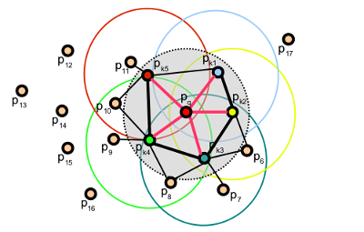

# ***点特征直方图描述子 PFH***

## **一. 描述子（Descriptor）**

在计算机视觉中，视觉描述子或图像描述子是对图像，视频或产生此类描述的算法或应用程序中内容的视觉特征的描述。它们描述了基本特征，例如形状，颜色，纹理或运动等。

[视觉描述子](https://en.wikipedia.org/wiki/Visual_descriptor)

## **二. 点特征直方图（Point Feature Histograms, PFH）**

#### 1. PFH涉及到的点云特征：  
```X，Y，Z，Normal # 基于点与其k领域之间的关系以及它们的估计法线 ```  
  
但是不直接使用这4个值，而是通过这4个值计算出另外4个值：  

```(α, ϕ, θ, d) # 3个角度和1个距离，是一个点对的特征```

#### 2. 计算复杂性：
O($k^2$)  
注：pcl书上写的O($k$)是错的

#### 3. 图示：


#### 4. uvw坐标系：
点对中以某个点为原点的坐标系

#### 5. PFH 特征表达了点云的什么局部特性：
PFH公式的目的是对点的k邻域几何特性进行编码，通过使用值的多维直方图概括点周围的平均曲率


#### 5. 官方文档：
[pfh_estimation](https://www.notion.so/d01420696797457ab966d6012be3b710#d0fe4dbd108641b39cdcc70e1169e444)

[fpfh_estimation](https://www.notion.so/d01420696797457ab966d6012be3b710#e69045f9779742169a416e8468442783)
