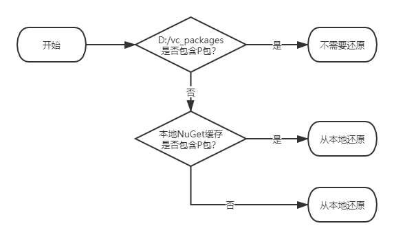

当服务器上的NuGet包出现更改，如何应用到本地？

---

# NuGet包加载层级
* D:/vc_packages：保存所有项目当前正使用的NuGet包；
* 本地NuGet缓存：缓存所有加载过的NuGet包；
* NuGet服务器：远端。

# NuGet包还原顺序
> 当程序用到某NuGet包（下称P包），VS如何判断是否需要还原，从哪里还原。

# 解决方案
> 服务器上的NuGet包（下称P包）出现更改，如何应用到本地？
1. 从D:/vc_packages中删除P包，确保发生“还原NuGet包”；
2. 从本地NuGet缓存删除P包，确保发生“从NuGet服务器还原NuGet包”。

其中第二步有两种实现方式：
* 在工具-选项-NuGet包管理器-常规中，点击“清除所有NuGet缓存”按钮；
* 在C:\Users\用户名\\.nuget\packages（默认本地NuGet缓存目录）下，手动删除P包。